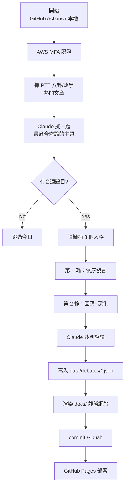

# AI 多人格辯論擂台

每天自動從 PTT 八卦版 / 政黑版挑出熱門議題，隨機抽 3 個 AI 人格輪流辯論 2 回合，最後由 Claude 擔任裁判評論，輸出為靜態網站並支援 giscus 留言。

## 功能流程



## 專案結構

```
ai-debate-arena/
├── .github/workflows/daily.yml  # 每日 07:20 (TW) 觸發
├── config.yaml                  # 模型、PTT、辯論、giscus 設定
├── requirements.txt
├── prompts/
│   ├── topic_picker.md          # 給 Claude 挑題的指示
│   ├── debater.md               # 給 Claude 扮演辯論者的指示
│   └── judge.md                 # 給 Claude 評審的指示
├── src/
│   ├── main.py                  # 入口
│   ├── ptt_scraper.py           # PTT 爬蟲
│   ├── topic_picker.py          # 熱門文彙整 + Claude 挑題
│   ├── personas.py              # 8 個人格定義
│   ├── debate.py                # 辯論主流程
│   ├── render.py                # HTML 渲染
│   └── template.html            # 網頁模板
├── utils/
│   └── aws_auth.py              # AWS MFA 共用模組（從 my_ai repo 複製）
├── data/debates/                # JSON 原始紀錄（進版控，供歷史辯論渲染）
└── docs/                        # 靜態網站（自動生成，GitHub Pages 發布）
    ├── index.html
    ├── archive.html
    └── debates/debate_YYYY-MM-DD.html
```

## 人格池

每日從以下 8 個人格中**隨機抽 3 個**：

| Emoji | 名稱 | 風格 |
| --- | --- | --- |
| 🤖 | 理性工程師 | 數據與邏輯至上 |
| 🦉 | 哲學系阿肥 | 追問本質、揭露預設 |
| 😏 | PTT 酸酸 | 鄉民嘴砲 |
| 👵 | 里長阿嬤 | 生活經驗 + 台語俗諺 |
| 💰 | 華爾街之狼 | 自由市場信徒 |
| 🤝 | 社工小陳 | 弱勢視角 |
| 📚 | 歷史老師 | 歷史脈絡 |
| ✨ | Z世代學生 | 世代斷裂 |

## 設定

### AWS 憑證（本地）

參考 [`my_ai/test/nba_daily_report/README.md`](../nba_daily_report/README.md#mfa-認證組織-scp-要求-mfa) 的 MFA 設定：

```bash
export AWS_MFA_SERIAL=arn:aws:iam::xxxxx:mfa/YOUR_USER
export AWS_MFA_SEED=YOUR_BASE32_SEED
```

或在 `~/.aws/config` 裡設 `mfa_serial`（會互動詢問 6 碼）。

### AWS 憑證（GitHub Actions）

在新 repo 的 Settings → Secrets and variables → Actions 加入：

- `AWS_ACCESS_KEY_ID`
- `AWS_SECRET_ACCESS_KEY`
- `AWS_MFA_SERIAL`（若有 MFA 要求）
- `AWS_MFA_SEED`（若有 MFA 要求）

### giscus 留言

1. 將 repo 設為 public
2. 在 Settings → General → Features 啟用 Discussions
3. 到 <https://giscus.app> 取得 `data-repo-id` 與 `data-category-id`
4. 填入 `config.yaml` 的 `giscus` 區塊並把 `enabled` 改為 `true`

### GitHub Pages

在 Settings → Pages：
- Source: GitHub Actions

workflow 會自動部署 `docs/`。

## 本地執行

```bash
# 在 my_ai repo 的虛擬環境下
cd test/ai-debate-arena
pip install -r requirements.txt

# 正常跑（抓 PTT、抽人格、辯論、渲染）
python -m src.main

# 只重新渲染網頁（不呼叫 Claude）
python -m src.main --render-only

# 手動指定題目
python -m src.main --topic "政府是否應該補貼私立大學學費？"

# 手動指定人格（跳過隨機抽選）
python -m src.main --personas engineer,grandma,netizen

# 固定隨機種子（方便 debug）
python -m src.main --seed 42
```

## 排程

GitHub Actions `daily.yml` 設定為每日 **UTC 23:20** 觸發（= 台灣時間 **07:20**），依序：

1. 跑 `python -m src.main`
2. commit 更新後的 `docs/` 與 `data/debates/`
3. 部署到 GitHub Pages

## 設計備註

- **題目中性化**：Claude 會把 PTT 原標題重新包裝成中性的問句，避免情緒化用語。
- **人身攻擊過濾**：`topic_picker.md` 的 prompt 明確要求跳過仇恨/人身攻擊類文章。
- **不虛構數據**：`debater.md` 要求人格不能生成假數據或假新聞。
- **時區**：以台灣時間為基準（`Asia/Taipei`）。
- **Token 計量**：每次呼叫 Claude 都會印出 input/output tokens，方便追蹤成本。
- **超時保護**：全域 15 分鐘 timeout。

## 已知限制

- PTT 首頁 HTML 結構若改動，爬蟲可能需要同步更新。
- Claude 挑題偶爾會選到太本地化或過於情緒化的題目，可透過 `--topic` 手動覆蓋。
- 人格之間的 `random.Random(seed)` 不會跨 Python 版本保證相同結果（僅供 debug）。
